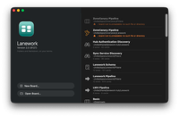
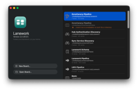

it did not open on its own, instead it presented the welcome window with two entries both old and new locations:

both tagged as "no such file". of course the Lanework is valid and on double click it opened fine. the old location remained tagged with an error, new location healed after open:

